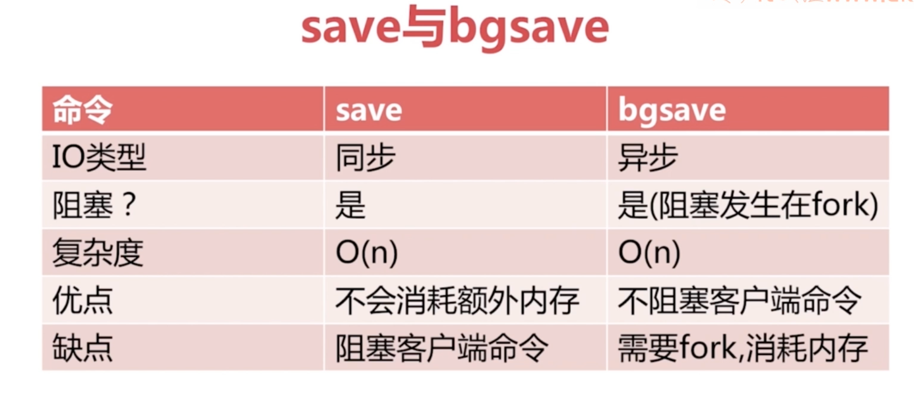
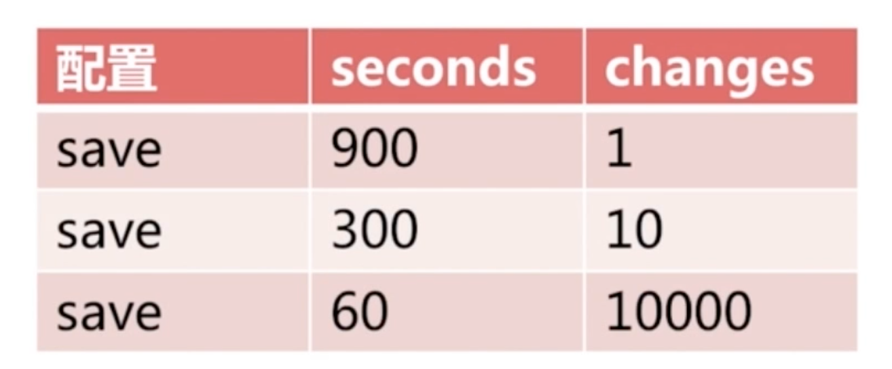
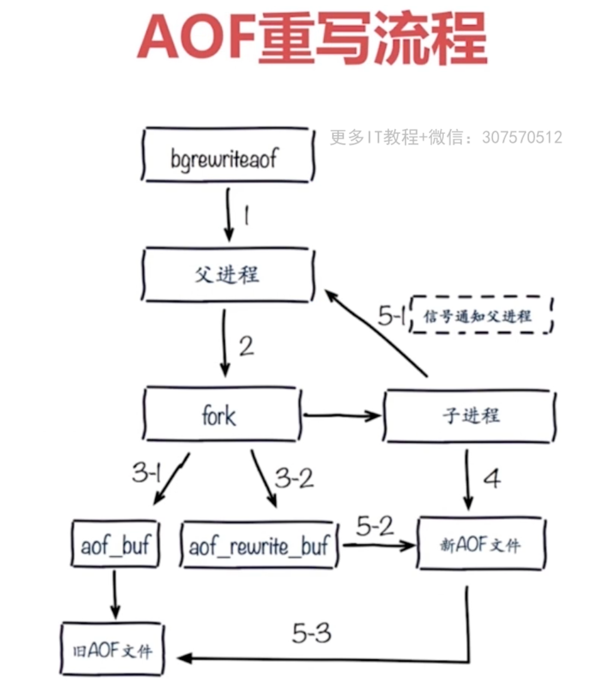

redis所有数据保持在内存中，对数据的更新将异步地保存到磁盘上。

持久化方式：1、快照=>mysql dump ; redis RDB

​            2、写日志=>mysql binlog;Hbase hlog;redis AOF

1. RDB
    1. 什么是RDB
        1. 通过专门的命令将内存数据生成快照，将快照创建至硬盘上形成RDB文件（二进制）
        2. 启动载入硬盘上的RDB文件
        3. 复制媒介（用于主从复制）
    2. 触发机制-主要三种方式
        1. save（同步），文件策略：如存在老的RDB文件，新替换老，复杂度O(n)级别
        2. bgsave（异步），通过Linux fork()生成redis子进程，由子进程生成RDB后由子进程告诉主进程是否完成，文件策略和复杂度同save命令
        3. 自动
            1. 通过bgsave生成
    3. 触发机制-不容忽略方式
        1. 全量复制
        2. debug reload
        3. shutdown
2. AOF
    1. RDB现存的问题
        1. 耗时、耗性能
            1. O(n)数据：耗时
            2. fork()：消耗内存，copy-on-write策略
            3. Disk I/O：IO性能
        2. 不可控，丢失数据
    2. AOF运行原理
        1. 创建：AOF日志追加，每执行一次命令追加一次
        2. 恢复：完整恢复
        3. 三种策略
            1. always：缓冲区将每条命令fsyn到硬盘AOF文件
            2. everysec：缓冲区每秒将每条命令fsyn到硬盘AOF文件，如出现故障可能会丢失命令数据
            3. no：操作系统决定fsync到硬盘AOF文件
            4. 三种策略优缺点：

| 命令 | always                                | everysec                  | No     |
| ---- | ------------------------------------- | ------------------------- | ------ |
| 优点 | 不丢失数据                            | 每秒一次fsync，降低IO开销 | 不用管 |
| 缺点 | IO开销较大，一般的机械硬盘只有几百TPS | 丢1秒数据                 | 不可控 |

- AOF重写
    - 减少硬盘占用量
    - 加速恢复速度
    - 实现两种方式
        - brrewriteaof 类似bgsave，使用fork()子进程来进行，将当前redis内存数据重塑到AOF文件
        - AOF重写配置
            - auto-aof-rewrite-min-size #AOF文件重写需要的尺寸
            - auto-aof-rewrite-percentage #AOF文件增长率
        - AOF统计配置
            - aof_current_size #AOF当前尺寸（单位：字节）
            - aof_base_size #AOF上次启动和重写的尺寸（单位：字节）
        - 自动触发时机(同时满足)
            - aof_current_size > auto-aof-rewrite-min-size
            - (aof_current_size - aof_base_size)/aof_base_size > auto-aof-rewrite-percentage
        - 重写流程
            - 
    - AOF配置
        - appendonly yes
        - appendfiliename "appendonly-${port}.aof"
        - appendfsync everysec
        - no-appendfsync-on-rewrite yes #进行aof重写的时候是否需要进行append操作，不进行此操作，因为aof重写很耗性能，性能优先级设为yes，数据优先级设为no 
        - aof-load-truncated yes #AOF文件恢复的时候是否忽略执行失败

| 原生AOF                                     | AOF重写            |
| ------------------------------------------- | ------------------ |
| set hello worldset hello javaset hello hehe | set hello hehe     |
| incr counterincr counter                    | set counter 2      |
| rpush mylist arpush mylist brpush mylist c  | rpush mylist a b c |
| 过期数据                                    |                    |

​     3.RDB和AOF的选择

​      

-  RDB和AOF比较

| 命令       | RDB    | AOF          |
| ---------- | ------ | ------------ |
| 启动优先级 | 低     | 高           |
| 体积       | 小     | 大           |
| 恢复速度   | 快     | 慢           |
| 数据安全性 | 丢数据 | 根据策略决定 |
| 轻重       | 重     | 轻           |

- RDB最佳策略
    - “关”
    - 集中管理
    - 主从，从节点开启
- AOF最佳策略
    - “开”：缓存和存储
    - AOF重写集中管理
    - everysec策略
- 最佳策略
    - 小分片，比如规划redis max memory=4G
    - 缓存或存储
    - 监控（硬盘、内存、负载、网络）
    - 足够的内存

4.fork操作

1. 同步操作
2. 内存越大，耗时越长（虚拟机比物理机更慢）
3. info:latest_fork_usec
4. 改善fork操作性能
    1. 优先使用物理机或高效支持fork操作的虚拟机
    2. 控制redis实例可用最大内存：maxmemory
    3. 合理配置Linux内存分配策略：vm.overcommit_memory=1
    4. 降低fork频率：例如放宽AOF自动重写触发机制，避免不必要的全量复制
5. 子进程开销和优化
    1. CPU:
        1. 开销：RDB和AOF文件生成，属于CPU密集型
        2. 优化：不做CPU绑定，不和CPU密集型部署
        3. 单机多部署的时候避免大量同时的RDB和AOF
    2. 内存：
        1. 开销：fork内存开销，父子进程内存共享，copy-on-write
        2. 优化：echo never > /sys/kernel/mm/transparent_hugepage/enabled
    3. 硬盘：
        1. 开销：AOF和RDB文件写入，可以结合iostat，iotop分析
        2. 优化：
            1. 不要和高硬盘负载服务器部署一起：存储服务，消息队列等
            2. 配置no-appendfsync-on-write = yes
            3. 根据写入量决定磁盘类型：例如ssd
            4. 单机多部署持久化文件目录可以考虑分盘
6. AOF追加阻塞定位
    1. 通过Redis日志：…AOF fsync is taking too long(disk is busy?)….
    2. info persistence: aof_delayed_fsync: 100 
    3. 硬盘IO状态

​             