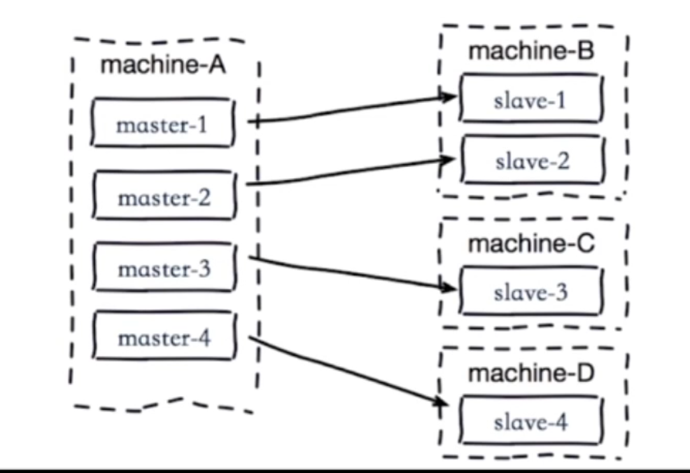

# 11 Redis主从复制

## 1主从复制

- 单机存在的问题
    - 机器故障
    - 容量瓶颈
    - QPS瓶颈
- 主从复制的作用
    - 数据副本
    - 扩展读性能

**一个master可以有多个slave；一个slave只能有一个master**

数据流向是单向的，master到slave

## 2配置

- slaveof命令
    - slaveof ip port异步命令
    - slaveof no one取消复制，取消后slave保留之前复制数据，不会复制新数据
- info replication命令查看主从分片信息
- 配置
    - replicaof ip port

## 3全量复制和部分复制

### 3.1全量复制

- 偏移量：通过info replication命令各自查看master和slave的同步偏移量master_repl_offset，如果相差太多，master和slave可能出现同步问题，如阻塞或网络问题

- 节点id：replid redis节点id，每次服务重启生成一个新的，所以节点并不知道谁是之前的节点。所以这样每次都是全量复制。

- 全量复制的过程：

    1. slave向master发起：psync ? -1

    2. master向slave进行复制：fullresync {repliId} {offset}

    3. slave save masterInfo

    4. master bgsave生产快照

    5. master将快照RDB文件写repl_back_buffer后发送RDB到slave

    6. master send buffer到slave

    7. slave flush old data

    8. slave load RDB

        

#### 全量复制开销

- bgsave时间
- RDB文件网络传输时间
- 从节点清空数据时间
- 从节点加载RDB的时间
- 可能的AOF重写时间

### 3.2部分复制

- 部分复制过程：

    1. slave与master出现网络抖动等情况（Connection lost）
    2. master写缓冲区
    3. slave重连至master
    4. slave发送psync请求，并附带自己的偏移量和replid
    5. master如果发现slave offset在范围内则继续复制
    6. 发送复制后续数据

    

## 4故障处理

- 哨兵模式

## 5开发运维中的问题

1. 读写分离

    - 读流量分摊到从节点
    - 可能遇到的问题
        - 复制数据延迟
        - 读到过期数据，由redis删除策略造成，懒删除策略是redis使用key的时候才检测key是否过期，而slave节点又没有删除数据的操作权限，就会导致这个问题（v3.2+已解决这个问题）
        - 从节点故障

2. 主从配置不一致

    - 例如maxmemory不一致，导致丢失数据
    - 例如数据结构优化参数（例如hash-max-ziplist-entries等)，导致内存不一致

3. 规避全量复制

    - 导致全量复制的场景
        - 第一次全量复制，第一次不可避免
        - 节点replid不匹配，主节点重启（replid变化）
        - 复制积压缓冲区不足（repl_back_buffer(v6+为repl-backlog-size)，默认1M）
    - 小主节点、低峰
    - 故障转移，例如哨兵或集群

4. 规避复制风暴

    - 单主节点复制风暴：

        - 主节点重启，多从节点复制。解决：更换复制拓扑

        

    - 单机器复制风暴

        - 如图，机器宕机后，大量全量复制。解决：主节点分散多机器

        