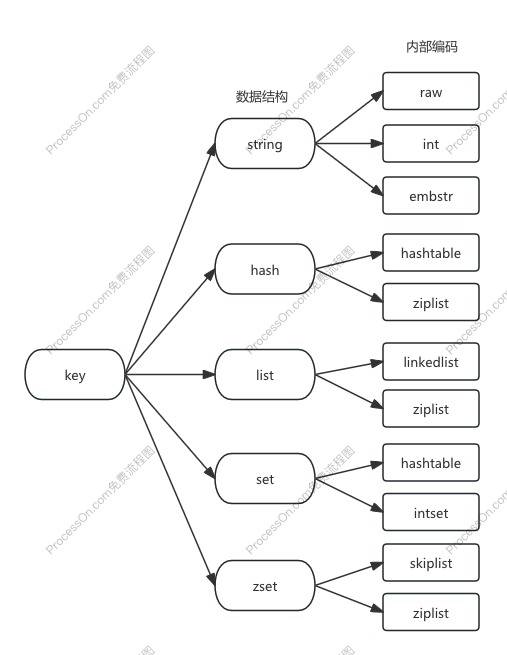

# 1通用命令

1. keys [pattern]
    - \#遍历所有key * | #遍历所有he开头的 keys he* | #遍历所有he开头包含l的 keys he[l] | #遍历所有指定长度的 keys ph?
    - 不在生产环境使用，O(n)级别
    - 通过热备从节点或scan命令使用
2. dbsize #计算key总数，可在生产环境使用，O(1)级别，Redis内置计数器
3. exists key #检测key是否存在，存在返回1，不存在返回0，O(1)级别
4. del key [key…] #删除指定key-value，可删除多个，O(1)级别
5. expire key [seconds]
    - O(1)级别
    - key在seconds秒后过期
    - ttl key #查看key剩余的过期时间，-1表示key存在但并没有设置过期；-2表示key已不存在，O(1)级别
    - persist key #去掉key的过期时间，O(1)级别
6. type key #返回key的类型，O(1)级别

# 2数据结构和内部编码

- 
- Redis内部Object：
    - 数据类型（type）：string，hash，list，set，zset
    - 编码方式（encoding）：raw，int，ziplist，linkedlist，hashmap，intset，quicklist（v3.2+）
    - 数据指针（ptr）
    - 虚拟内存（vm）
    - 其他信息

- 单线程架构
    - redis单线程为什么这么快
        1. 纯内存，100ns
        2. 非阻塞IO，epoll多路复用，event LOOP
        3. 避免线程切换和竞态消耗
    - 使用单线程需要注意什么
        1. 一次只运行一条命令
        2. 拒绝长（慢）命令
            1. keys
            2. flushdb
            3. slow lua script
            4. exec multi
            5. operate big value(collection)
- 其实不是单线程
    1. fsync file descriptor
    2. close file descriptor

| 命令            | 复杂度 |
| --------------- | ------ |
| dbsize exists   | O(1)   |
| del expire type | O(1)   |
| key flushdb     | O(n)   |