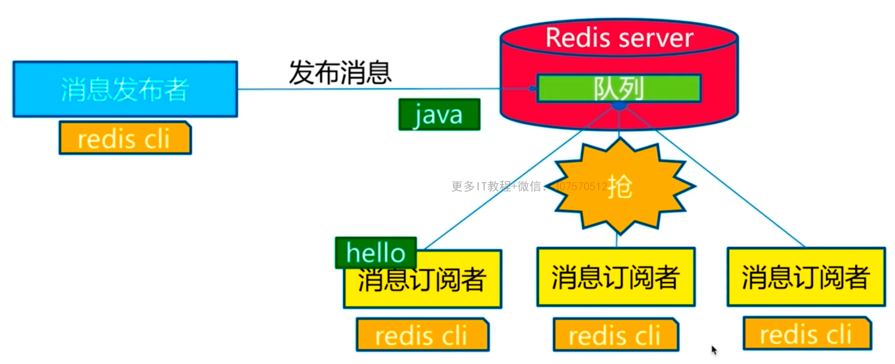

1. 慢查询
2. pipeline
3. 发布订阅
4. Bitmap
5. Hyperloglog
6. GEO

- 慢查询
    - 生命周期

​          

​         两点说明：1、慢查询发生在第3阶段；2、客户端超时不一定慢查询，但慢查询是客户端超时的一个可能因素

- 

- 两个配置，慢查询是个固定长度的队列，通过修改配置文件或运行时通过config set动态配置

- - slowlog-max-len
        - 先进先出队列
        - 固定长度
        - 保存在内存内
    - slowlog-log-slower-than
        - 慢查询阈值（单位：微妙）
        - slowlog-log-slower-than=0，记录所有命令，小于0则不记录

- 慢查询命令

- - slowlog get #获取慢查询队列
    - slowlog len #获取慢查询队列长度
    - slowlog reset #重置清空

- 运维经验

- - slowlog-log-slower-than不要设置过大，默认10ms（10000ns），通常设置1ms（1000ns）
    - slowlog-max-len不要设置过小，默认128，通常设置1000左右
    - 理解命令生命周期
    - 定期持久化慢查询，通过slowlog get存储在mysql等其他db

- pipeline

    - N次命令操作使用1次网络时间+N次命令时间
        - Redis命令时间是微妙级别
        - pipeline解决网络时间
    - 与原生M命令操作
        - M命令式原子的
        - pipeline非原子操作，但返回顺序是一致的
    - 使用建议
        - 注意每次pipeline携带数据量
        - pipeline每次只能作用在一个redis节点上

- 发布订阅

    - 角色
        - publisher #发布者
        - subscriber #订阅者
        - channel #频道
    - 模型
        - 
    - API
        - publish channel message
        - subscribe channel #一个或多个
        - unsubscribe channel #一个或多个
        - psubscribe [pattern…] #订阅模式，订阅一堆频道
        - punsubscribe [pattern…] #取消订阅模式
        - pubsub channels #列出至少有一个订阅者的频道
        - pubsub numsub [channel…] #列出给定频道的订阅者数量
    - 发布订阅与消息队列
        - 消息队列
            - 通过list阻塞实现：

- Bitmap 位图

    - setbit key offset value #给位图指定索引设置值，只能设置0和1，要注意偏移量，位图会进行补0操作
    - getbit key offset #获取指定偏移量
    - bitcount key [start end] #获取位图指定范围（start到end，单位为字节，如果不指定就是获取全部）位值为1的个数
    - bitop operation destkey key [key…] #做多个Bitmap的and（交集）、or（并集）、not（非）、xor（异或）操作并将结果保存在destkey中
    - bitpos key targetBit [start] [end] #计算位图指定范围（start到end，单位为字节，如果不指定就是获取全部）第一个偏移量对应的值等于targetBit的位置

- Hyperloglog

    - 极小空间完成独立数量统计
    - 本质还是字符串
    - pfadd key element [element…] 
    - pfcount key [key…] #计算独立总数
    - pfmerge destkey sourcekey [sourcekey…] #合并多个hyperloglog
    - 
    - 错误率0.81%
    - 无法取出单条数据

- GEO

    - geoadd key longitude latitude member [longitude latitude member…] #增加地理位置信息
    - geopos key member [member…] #获取地理位置信息
    - geodist key member1 member2 [unit] #获取两个地理位置的距离,unit:m,km,mi（英里）,ft（尺）
    - 
    - geo使用zset实现，要删除某个元素使用zrem key member